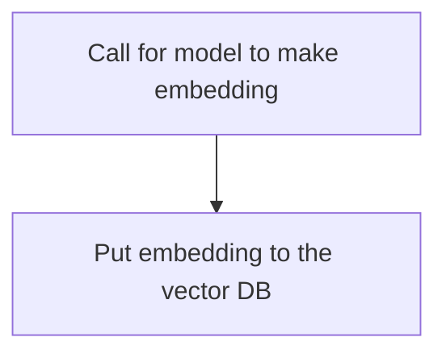
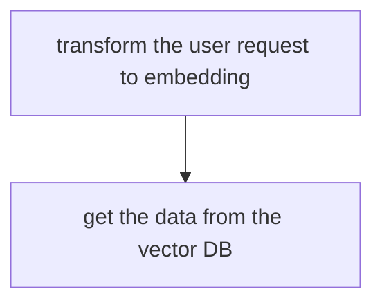

# Architecture, v.0.0.1

## Pipline 

### Gathering data diagram 

### Get the persona notes from the diagram (simplified)

## Cloude Models to make embeddings

### OpenAI -- Embeddings API

### Cohere - Embed API

### Hugging Face Interference API (Sentence-Transformers)

## Vector DBs - self hosted

### Qdrant(OSS)

### Chroma 

## Intergation tool to handle 

## LangChain