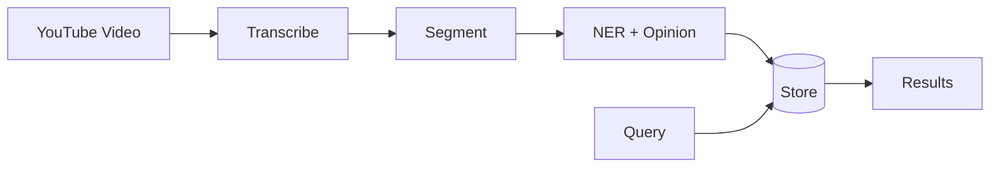
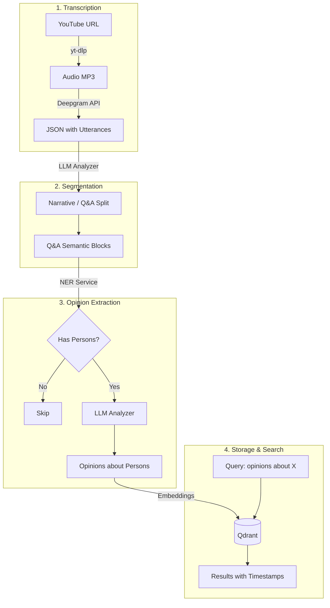

# Architecture

> High-level system architecture for the Media RAG Pipeline.

## Table of Contents

- [Overview](#overview)
- [End-to-End Pipeline](#end-to-end-pipeline)
- [Components](#components)
  - [Transcription (Deepgram)](#transcription-deepgram)
  - [LLM Analyzer Service](#llm-analyzer-service)
  - [NER Service](#ner-service)
  - [Vector Database (Qdrant)](#vector-database-qdrant)
- [Directory Structure](#directory-structure)
- [Environment Variables](#environment-variables)

---

## Overview

The Media RAG Pipeline extracts and analyzes YouTube video transcripts to find and search opinions about persons.



**For step-by-step manual testing, see [PIPELINE_GUIDE.md](./PIPELINE_GUIDE.md)**

---

## End-to-End Pipeline

The complete pipeline from YouTube video to searchable opinions:



### Pipeline Steps

| Step | Service | Port | Input | Output |
|------|---------|------|-------|--------|
| 1a | `src/transcribe.py` | - | YouTube URL | Audio MP3 |
| 1b | Deepgram API | - | Audio MP3 | JSON with utterances |
| 2 | LLM Analyzer | 8001 | Deepgram JSON | Q&A blocks |
| 3a | NER Service | 8000 | Block text | persons[] |
| 3b | LLM Analyzer | 8001 | Block + persons | has_opinion, targets |
| 4a | `src/ingest.py` | - | Blocks + metadata | Embeddings |
| 4b | Qdrant | 6333 | Embeddings | Stored vectors |
| 5 | `src/query.py` | - | Search query | Relevant results |

### Key Insight: Pipeline Order

```
Transcribe → Segment → NER → Opinion → Store → Search
                ↑
    Segmentation happens BEFORE opinion detection!
```

Q&A Segmentation breaks the transcript into meaningful semantic blocks. Opinion detection then runs on each block (after NER finds persons). This ensures:
- Opinions are associated with specific Q&A topics
- Context is preserved for each answer
- Search results have accurate timestamps

---

## Components

### Transcription (Deepgram)

| Tool | Purpose |
|------|---------|
| `yt-dlp` | Download audio from YouTube |
| Deepgram API | Speech-to-text with timestamps |

**Usage:**
```bash
uv run python src/transcribe.py "https://youtube.com/watch?v=VIDEO_ID"
# Creates: data/transcripts/VIDEO_ID.json
```

**Deepgram output contains:**
- Full transcript text
- Word-level timestamps
- Utterances (used for segmentation)
- Paragraphs (for SRT generation)

---

### LLM Analyzer Service

| Capability | Endpoint | Purpose |
|------------|----------|---------|
| Q&A Segmentation | `POST /segment/qa/from-deepgram` | Split transcript into semantic blocks |
| Opinion Detection | `POST /detect-opinion` | Detect opinions about persons |

**Port:** 8001

**Quick Start:**
```bash
cd services/llm-analyzer
docker build -t llm-analyzer:latest .
docker run --rm -p 8001:8001 \
  -e OPENAI_API_KEY="$OPENAI_API_KEY" \
  llm-analyzer:latest
```

**Segmentation Example:**
```bash
curl -X POST "http://localhost:8001/segment/qa/from-deepgram" \
  -H "Content-Type: application/json" \
  -d "{\"video_id\": \"VIDEO_ID\", \"deepgram_json\": $(cat data/transcripts/VIDEO_ID.json)}"
```

See [LLM_ANALYZER_SERVICE.md](./LLM_ANALYZER_SERVICE.md) for details.

---

### NER Service

| Model | Purpose |
|-------|---------|
| `r1char9/ner-rubert-tiny-news` | Detect Russian person names |

**Port:** 8000

**Quick Start:**
```bash
cd services/ner
docker build -t ner-service:latest .
docker run --rm -p 8000:8000 ner-service:latest
```

**Example:**
```bash
curl -X POST "http://localhost:8000/ner/persons" \
  -H "Content-Type: application/json" \
  -d '{"text": "Иванов раскритиковал Петрова."}'
# {"persons": ["Иванов", "Петрова"], "has_persons": true}
```

See [NER_SERVICE.md](./NER_SERVICE.md) for details.

---

### Vector Database (Qdrant)

| Setting | Value |
|---------|-------|
| REST Port | 6333 |
| gRPC Port | 6334 |
| Collection | `mentions_mvp` |
| Distance | Cosine |

**Quick Start:**
```bash
docker run --rm -p 6333:6333 -p 6334:6334 \
  -v $(pwd)/qdrant_storage:/qdrant/storage \
  qdrant/qdrant
```

**Ingest & Query:**
```bash
uv run python src/ingest.py data/transcripts/VIDEO_ID.txt
uv run python src/query.py "мнение о Иванове"
```

See [QDRANT_LOCAL_SETUP.md](./QDRANT_LOCAL_SETUP.md) for details.

---

## Directory Structure

```
media_rag_pipeline/
├── src/
│   ├── transcribe.py    # YouTube → Deepgram → JSON/SRT/TXT
│   ├── ingest.py        # Chunks → Embeddings → Qdrant
│   └── query.py         # Search Qdrant
│
├── services/
│   ├── ner/             # Russian PERSON-NER (port 8000)
│   │   ├── app/main.py
│   │   └── Dockerfile
│   │
│   └── llm-analyzer/    # Segmentation + Opinion (port 8001)
│       ├── app/
│       │   ├── main.py
│       │   ├── schemas.py
│       │   ├── db.py
│       │   └── prompts.py
│       ├── exports/     # JSON export files
│       └── Dockerfile
│
├── data/
│   ├── transcripts/     # Deepgram outputs (JSON, SRT, TXT)
│   └── opinions/        # SQLite cache (gitignored)
│
├── docs/                # Documentation
│   ├── ARCHITECTURE.md  # This file
│   ├── PIPELINE_GUIDE.md # Step-by-step testing
│   ├── LLM_ANALYZER_SERVICE.md
│   └── NER_SERVICE.md
│
└── qdrant_storage/      # Qdrant data (gitignored)
```

---

## Environment Variables

| Variable | Required | Description |
|----------|----------|-------------|
| `OPENAI_API_KEY` | Yes | OpenAI API for LLM Analyzer and embeddings |
| `DEEPGRAM_API_KEY` | Yes | Deepgram API for transcription |
| `QDRANT_URL` | No | Qdrant URL (default: localhost:6333) |
| `QDRANT_COLLECTION` | No | Collection name (default: mentions_mvp) |

Create `.env` file in project root:
```bash
OPENAI_API_KEY=sk-...
DEEPGRAM_API_KEY=...
```
