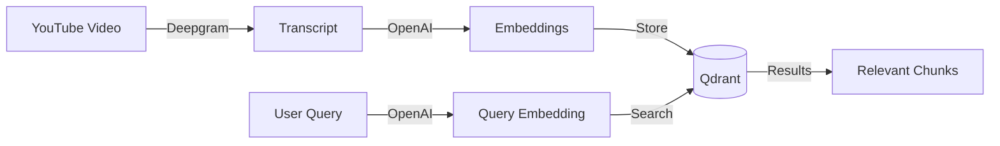
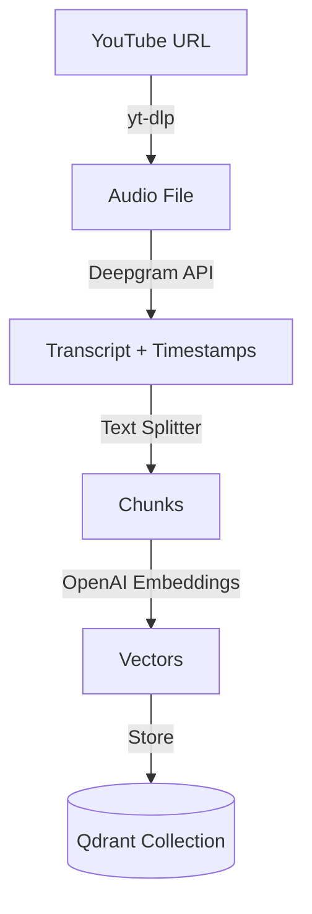
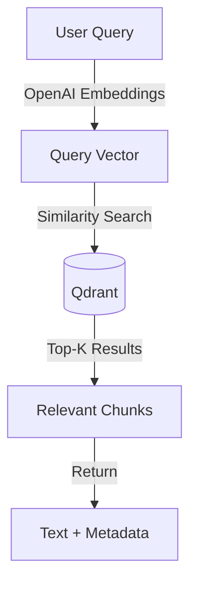

# Architecture

> High-level system architecture for the Media RAG Pipeline.

## Table of Contents

- [Overview](#overview)
- [Pipeline](#pipeline)
  - [Data Ingestion](#data-ingestion)
  - [Query Flow](#query-flow)
- [Components](#components)
  - [Transcription](#transcription)
  - [Embeddings](#embeddings)
  - [Vector Database](#vector-database)
  - [Orchestration](#orchestration)

---

## Overview

The Media RAG Pipeline extracts transcripts from YouTube videos, generates embeddings, stores them in a vector database, and enables semantic search.



---

## Pipeline

### Data Ingestion



**Steps:**
1. Download audio from YouTube using `yt-dlp`
2. Transcribe with Deepgram (word-level timestamps)
3. Split transcript into chunks (800 chars, 120 overlap)
4. Generate embeddings via OpenAI API
5. Store vectors with metadata in Qdrant

### Query Flow



**Steps:**
1. Convert user query to embedding
2. Search Qdrant for similar vectors
3. Return top-k chunks with metadata (timestamps, source)

---

## Components

### Transcription

| Service | Purpose | Status |
|---------|---------|--------|
| **Deepgram** | Speech-to-text transcription | Active |
| yt-dlp | YouTube audio download | Active |

**Deepgram Features Used:**
- Model: `nova-3` (latest)
- Smart formatting (dates, numbers, emails)
- Word-level timestamps
- SRT subtitle generation
- Optional speaker diarization

### Embeddings

| Provider | Model | Dimensions | Status |
|----------|-------|------------|--------|
| **OpenAI** | `text-embedding-3-small` | 1,536 | Active |
| OpenAI | `text-embedding-3-large` | 3,072 | Available |
| Cohere | Embed API | - | Planned |
| Hugging Face | Sentence-Transformers | - | Planned |

### Vector Database

| Database | Deployment | Status |
|----------|------------|--------|
| **Qdrant** | Docker (local) | Active |
| Chroma | - | Planned |

**Qdrant Configuration:**
- Collection: `mentions_mvp`
- Distance metric: Cosine similarity
- Ports: 6333 (REST), 6334 (gRPC)

### Orchestration

| Tool | Purpose | Status |
|------|---------|--------|
| **LangChain** | Pipeline orchestration | Active |
| python-dotenv | Environment management | Active |

---

## Directory Structure

```
media_rag_pipeline/
├── src/
│   ├── ingest.py        # Ingest transcripts → Qdrant
│   ├── query.py         # Query Qdrant
│   └── transcribe.py    # YouTube → Deepgram → files
├── data/
│   └── transcripts/     # Transcripts, SRT, audio
├── docs/                # Documentation
└── qdrant_storage/      # Qdrant data (gitignored)
```

---

## Environment Variables

| Variable | Required | Description |
|----------|----------|-------------|
| `OPENAI_API_KEY` | Yes | OpenAI API for embeddings |
| `DEEPGRAM_API_KEY` | Yes | Deepgram API for transcription |
| `QDRANT_URL` | No | Qdrant URL (default: localhost:6333) |
| `QDRANT_COLLECTION` | No | Collection name (default: mentions_mvp) |
