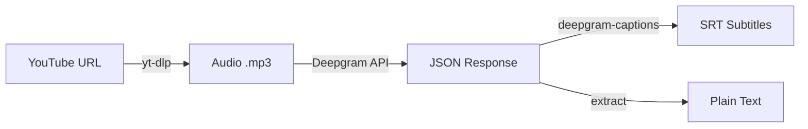

# Deepgram Transcription Guide

> Transcribe YouTube videos to text using Deepgram API.

## Table of Contents

- [Overview](#overview)
- [Prerequisites](#prerequisites)
- [Setup](#setup)
  - [Get Deepgram API Key](#get-deepgram-api-key)
  - [Install ffmpeg](#install-ffmpeg)
  - [Configure Environment](#configure-environment)
- [Usage](#usage)
  - [Basic Usage](#basic-usage)
  - [Command-Line Options](#command-line-options)
  - [Examples](#examples)
- [Output Files](#output-files)
  - [JSON Response](#json-response)
  - [SRT Subtitles](#srt-subtitles)
  - [Plain Text](#plain-text)
- [API Features](#api-features)
- [Troubleshooting](#troubleshooting)
- [References](#references)

---

## Overview

The transcription script downloads audio from YouTube videos and transcribes them using [Deepgram's](https://deepgram.com/) speech-to-text API.



**Why Deepgram?**
- Fast and accurate transcription
- Word-level timestamps
- Speaker diarization support
- Smart formatting (dates, numbers, emails)
- Multiple language support

---

## Prerequisites

| Requirement | Purpose |
|-------------|---------|
| Deepgram API key | Authentication |
| ffmpeg | Audio extraction from video |
| Python 3.12+ | Runtime |
| uv | Package manager |

---

## Setup

### Get Deepgram API Key

1. Go to [console.deepgram.com](https://console.deepgram.com/)
2. Sign up or log in
3. Navigate to **API Keys**
4. Create a new API key
5. Copy the key (it won't be shown again)

### Install ffmpeg

ffmpeg is required for extracting audio from YouTube videos.

**macOS (Homebrew):**
```bash
brew install ffmpeg
```

**Ubuntu/Debian:**
```bash
sudo apt update && sudo apt install ffmpeg
```

**Verify installation:**
```bash
ffmpeg -version
```

### Configure Environment

Add your Deepgram API key to `.env`:

```bash
# Copy the example file
cp .env.example .env

# Edit and add your key
echo "DEEPGRAM_API_KEY=your-key-here" >> .env
```

Or export directly:
```bash
export DEEPGRAM_API_KEY="your-key-here"
```

---

## Usage

### Basic Usage

```bash
uv run python src/transcribe.py "https://youtube.com/watch?v=VIDEO_ID"
```

This will:
1. Download audio from the YouTube video
2. Transcribe using Deepgram (Russian language by default)
3. Save JSON, SRT, and TXT files to `data/transcripts/`
4. Keep the audio file

### Command-Line Options

```
usage: transcribe.py [-h] [-l LANGUAGE] [-o OUTPUT_DIR] [--diarize]
                     [--filler-words] [--delete-audio] url

positional arguments:
  url                   YouTube video URL

options:
  -h, --help            show this help message and exit
  -l, --language        Language code (default: ru)
  -o, --output-dir      Output directory (default: data/transcripts)
  --diarize             Enable speaker diarization
  --filler-words        Include filler words like 'um', 'uh'
  --delete-audio        Delete audio file after transcription
```

### Examples

**Transcribe Russian video (default):**
```bash
uv run python src/transcribe.py "https://youtube.com/watch?v=VIDEO_ID"
```

**Transcribe English video:**
```bash
uv run python src/transcribe.py "https://youtube.com/watch?v=VIDEO_ID" --language en
```

**With speaker diarization (for interviews/podcasts):**
```bash
uv run python src/transcribe.py "https://youtube.com/watch?v=VIDEO_ID" --diarize
```

**Delete audio after transcription (save space):**
```bash
uv run python src/transcribe.py "https://youtube.com/watch?v=VIDEO_ID" --delete-audio
```

**Custom output directory:**
```bash
uv run python src/transcribe.py "https://youtube.com/watch?v=VIDEO_ID" -o ./my_transcripts
```

**Short URL format:**
```bash
uv run python src/transcribe.py "https://youtu.be/VIDEO_ID"
```

---

## Output Files

For a video with ID `dQw4w9WgXcQ`, the script creates:

| File | Description |
|------|-------------|
| `dQw4w9WgXcQ.json` | Full Deepgram API response |
| `dQw4w9WgXcQ.srt` | SRT subtitle file |
| `dQw4w9WgXcQ.txt` | Plain text transcript |
| `dQw4w9WgXcQ.mp3` | Audio file (unless `--delete-audio`) |

### JSON Response

The JSON file contains the complete Deepgram response:

```json
{
  "metadata": {
    "request_id": "...",
    "duration": 123.45,
    "channels": 1
  },
  "results": {
    "channels": [{
      "alternatives": [{
        "transcript": "Full transcript text...",
        "confidence": 0.98,
        "words": [
          {
            "word": "hello",
            "start": 0.0,
            "end": 0.5,
            "confidence": 0.99,
            "punctuated_word": "Hello"
          }
        ]
      }]
    }],
    "utterances": [
      {
        "start": 0.0,
        "end": 5.2,
        "transcript": "Hello, welcome to the video."
      }
    ]
  }
}
```

**Key fields:**
- `words[]`: Word-level timestamps and confidence
- `utterances[]`: Sentence-level segments (used for SRT)
- `confidence`: Transcription accuracy score

### SRT Subtitles

Standard SRT format with timestamps:

```srt
1
00:00:00,000 --> 00:00:05,200
Hello, welcome to the video.

2
00:00:05,500 --> 00:00:10,800
Today we're going to discuss...
```

### Plain Text

Clean transcript without timestamps:

```
Hello, welcome to the video. Today we're going to discuss...
```

---

## API Features

The script uses these Deepgram API features:

| Feature | Value | Description |
|---------|-------|-------------|
| `model` | `nova-3` | Latest, most accurate model |
| `smart_format` | `true` | Format dates, numbers, emails, URLs |
| `punctuate` | `true` | Add punctuation |
| `paragraphs` | `true` | Add paragraph breaks |
| `utterances` | `true` | Sentence segmentation (for SRT) |
| `filler_words` | `false` | Remove "um", "uh" by default |
| `diarize` | `false` | Speaker identification (optional) |

### Language Codes

Common language codes:

| Code | Language |
|------|----------|
| `ru` | Russian (default) |
| `en` | English |
| `de` | German |
| `fr` | French |
| `es` | Spanish |
| `uk` | Ukrainian |

Full list: [Deepgram Language Support](https://developers.deepgram.com/docs/models-languages-overview)

---

## Troubleshooting

### "DEEPGRAM_API_KEY is not set"

```bash
# Check if key is set
echo $DEEPGRAM_API_KEY

# Set it
export DEEPGRAM_API_KEY="your-key-here"

# Or add to .env file
echo "DEEPGRAM_API_KEY=your-key-here" >> .env
```

### "ffmpeg not found"

Install ffmpeg:
```bash
# macOS
brew install ffmpeg

# Ubuntu/Debian
sudo apt install ffmpeg
```

### "Could not extract video ID"

Supported URL formats:
- `https://youtube.com/watch?v=VIDEO_ID`
- `https://youtu.be/VIDEO_ID`
- `https://youtube.com/embed/VIDEO_ID`
- Just the video ID: `VIDEO_ID`

### "Audio file not created"

1. Check internet connection
2. Verify YouTube URL is valid and video is accessible
3. Check ffmpeg is installed: `ffmpeg -version`
4. Try updating yt-dlp: `uv add yt-dlp --upgrade`

### Rate Limits / Quota

If you hit Deepgram rate limits:
1. Check your usage at [console.deepgram.com](https://console.deepgram.com/)
2. Add credits if needed
3. Wait and retry

### Large Files

For long videos (>2 hours):
- Deepgram has a 2GB file size limit
- The script extracts audio only (much smaller than video)
- Consider splitting very long recordings

---

## References

- [Deepgram Documentation](https://developers.deepgram.com/docs/)
- [Deepgram API Reference](https://developers.deepgram.com/reference/)
- [Deepgram Python SDK](https://github.com/deepgram/deepgram-python-sdk)
- [deepgram-python-captions](https://github.com/deepgram/deepgram-python-captions)
- [yt-dlp Documentation](https://github.com/yt-dlp/yt-dlp)
- [SRT Format Specification](https://en.wikipedia.org/wiki/SubRip)
