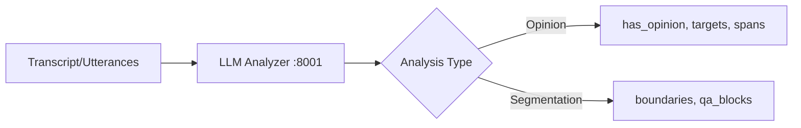

# LLM Analyzer Service

> FastAPI service providing LLM-powered text analysis: opinion detection and Q&A semantic segmentation.

## Table of Contents

- [Overview](#overview)
- [Quick Start](#quick-start)
  - [Docker](#docker-recommended)
  - [Local Development](#local-development)
- [API Endpoints](#api-endpoints)
  - [Opinion Detection](#opinion-detection)
  - [Q&A Segmentation](#qa-segmentation)
  - [Health Check](#health-check)
- [Configuration](#configuration)
- [Data Models](#data-models)
- [Usage Examples](#usage-examples)
- [Cost Estimates](#cost-estimates)

---

## Overview

The LLM Analyzer service uses OpenAI API to provide two main capabilities:

1. **Opinion Detection** - Detects whether text contains opinions about persons
2. **Q&A Segmentation** - Segments transcripts into narrative/Q&A regions and semantic blocks



---

## Quick Start

### Docker (Recommended)

```bash
cd services/llm-analyzer

# Build
docker build -t llm-analyzer:latest .

# Run (requires OPENAI_API_KEY)
docker run --rm -p 8001:8001 \
  -e OPENAI_API_KEY="$OPENAI_API_KEY" \
  -v $(pwd)/data:/app/data \
  -v $(pwd)/exports:/app/exports \
  llm-analyzer:latest
```

### Local Development

```bash
cd services/llm-analyzer

# Create virtual environment
python -m venv .venv
source .venv/bin/activate

# Install dependencies
pip install fastapi uvicorn[standard] openai pydantic tenacity

# Set environment variables
export OPENAI_API_KEY="sk-..."

# Run
uvicorn app.main:app --reload --port 8001
```

---

## API Endpoints

### Opinion Detection

#### `POST /detect-opinion`

Detect opinion in a single text chunk.

**Request:**
```json
{
  "chunk_id": "vid123_0042",
  "start": 120.0,
  "end": 165.0,
  "text": "Вот такое стремление Иванова к миру. Он всегда был за мирное решение.",
  "persons": ["Иванов"]
}
```

**Response:**
```json
{
  "has_opinion": true,
  "targets": ["Иванов"],
  "opinion_spans": ["Вот такое стремление Иванова к миру."],
  "polarity": "negative",
  "confidence": 0.86
}
```

#### `POST /detect-opinion/batch`

Detect opinions in multiple chunks.

**Request:**
```json
{
  "items": [
    {"chunk_id": "001", "start": 0, "end": 30, "text": "...", "persons": ["Иванов"]},
    {"chunk_id": "002", "start": 30, "end": 60, "text": "...", "persons": ["Петров"]}
  ]
}
```

**Response:**
```json
{
  "results": [
    {"has_opinion": true, "targets": ["Иванов"], ...},
    {"has_opinion": false, "targets": [], ...}
  ],
  "total_with_opinions": 1
}
```

#### `GET /chunks/{chunk_id}`

Retrieve stored detection result.

---

### Q&A Segmentation

#### `POST /segment/qa/boundaries` (Pass 1)

Segment transcript into **narrative** vs **Q&A** regions.

**Request:**
```json
{
  "video_id": "x5wmGSAmUQA",
  "utterances": [
    {"u": 0, "start": 0.0, "end": 3.2, "text": "Здравствуйте..."},
    {"u": 1, "start": 3.2, "end": 7.1, "text": "Сегодня поговорим..."}
  ]
}
```

**Response:**
```json
{
  "video_id": "x5wmGSAmUQA",
  "segments": [
    {"type": "narrative", "start_u": 0, "end_u": 120, "confidence": 0.84, "notes": "Intro and news"},
    {"type": "qa", "start_u": 121, "end_u": 360, "confidence": 0.79, "notes": "Q&A session"}
  ]
}
```

#### `POST /segment/qa/blocks` (Pass 2)

Segment Q&A region into semantic answer blocks.

**Request:**
```json
{
  "video_id": "x5wmGSAmUQA",
  "utterances": [
    {"u": 121, "start": 312.4, "end": 315.8, "text": "Первый вопрос..."}
  ],
  "qa_range": {"start_u": 121, "end_u": 360}
}
```

**Response:**
```json
{
  "video_id": "x5wmGSAmUQA",
  "qa_blocks": [
    {
      "start_u": 121,
      "end_u": 156,
      "questions": ["Как вы оцениваете ситуацию?"],
      "answer_summary": "Обсуждение текущей экономической ситуации",
      "confidence": 0.74
    }
  ]
}
```

#### `POST /segment/qa/run` (Combined)

Run full segmentation pipeline (Pass 1 + Pass 2).

**Request:**
```json
{
  "video_id": "x5wmGSAmUQA",
  "utterances": [...]
}
```

**Response:**
```json
{
  "video_id": "x5wmGSAmUQA",
  "boundary_segments": [...],
  "qa_blocks": [...]
}
```

#### `GET /segments/{video_id}`

Retrieve stored segmentation results.

#### `GET /exports/{video_id}`

Get exported JSON file for a video.

---

### Health Check

#### `GET /healthz`

```json
{
  "status": "healthy",
  "model": "gpt-4o-mini",
  "version": "2.0.0"
}
```

---

## Configuration

| Environment Variable | Default | Description |
|---------------------|---------|-------------|
| `OPENAI_API_KEY` | (required) | OpenAI API key |
| `OPENAI_MODEL` | `gpt-4o-mini` | Model to use |
| `MAX_TEXT_LENGTH` | `4000` | Max chars before truncation |
| `LLM_ANALYZER_DB_PATH` | `data/analyzer.db` | SQLite database path |
| `EXPORTS_DIR` | `exports` | Directory for JSON exports |

---

## Data Models

### Utterance (Input)

```json
{
  "u": 0,
  "start": 0.0,
  "end": 3.2,
  "text": "Utterance text..."
}
```

### Boundary Segment

```json
{
  "type": "narrative | qa",
  "start_u": 0,
  "end_u": 120,
  "confidence": 0.84,
  "notes": "Description of segment"
}
```

### Q&A Block

```json
{
  "start_u": 121,
  "end_u": 156,
  "questions": ["Question text if detected"],
  "answer_summary": "Short summary of answer",
  "confidence": 0.74
}
```

---

## Usage Examples

### curl

```bash
# Opinion detection
curl -X POST "http://localhost:8001/detect-opinion" \
  -H "Content-Type: application/json" \
  -d '{
    "chunk_id": "demo_001",
    "start": 0,
    "end": 30,
    "text": "Иванов молодец, справился с задачей.",
    "persons": ["Иванов"]
  }'

# Full Q&A segmentation
curl -X POST "http://localhost:8001/segment/qa/run" \
  -H "Content-Type: application/json" \
  -d '{
    "video_id": "test_video",
    "utterances": [
      {"u": 0, "start": 0.0, "end": 5.0, "text": "Начнем с новостей..."},
      {"u": 1, "start": 5.0, "end": 10.0, "text": "А теперь ваши вопросы..."}
    ]
  }'

# Get export
curl "http://localhost:8001/exports/test_video"
```

### Python

```python
import httpx

# Opinion detection
response = httpx.post(
    "http://localhost:8001/detect-opinion",
    json={
        "chunk_id": "demo_001",
        "start": 0,
        "end": 30,
        "text": "Иванов молодец.",
        "persons": ["Иванов"],
    },
)
result = response.json()
print(f"Has opinion: {result['has_opinion']}")

# Q&A segmentation
response = httpx.post(
    "http://localhost:8001/segment/qa/run",
    json={
        "video_id": "my_video",
        "utterances": utterances_list,
    },
)
segments = response.json()
print(f"Found {len(segments['qa_blocks'])} Q&A blocks")
```

---

## Cost Estimates

Using `gpt-4o-mini` (~$0.15/1M input tokens, ~$0.60/1M output tokens):

### Opinion Detection

| Scenario | Chunks/day | With persons | Cost/day |
|----------|------------|--------------|----------|
| 3h video | ~180 | ~50 (30%) | ~$0.05 |
| 10h video | ~600 | ~180 (30%) | ~$0.18 |

### Q&A Segmentation

| Pass | Tokens (avg) | Cost/video |
|------|--------------|------------|
| Pass 1 (boundaries) | ~5,000 | ~$0.001 |
| Pass 2 (Q&A blocks) | ~3,000 | ~$0.0005 |
| **Total** | ~8,000 | **~$0.002** |

---

## SQLite Schema

The service uses SQLite for persistence with four tables:

- `opinion_detection` - Stores opinion detection results
- `qa_boundary` - Stores narrative/Q&A segments
- `qa_block` - Stores semantic Q&A blocks
- `qa_export` - Caches JSON exports
