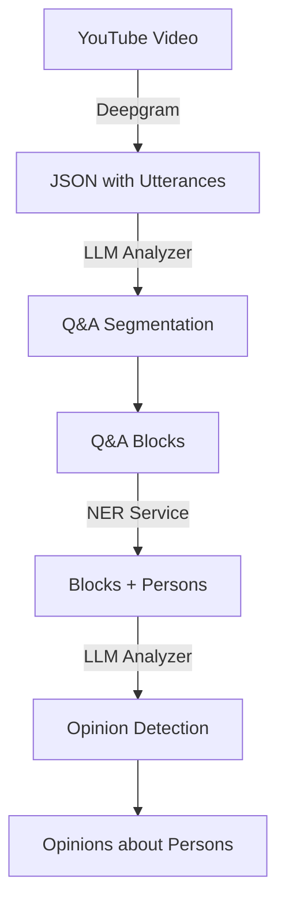

# LLM Analyzer Service

> FastAPI service providing LLM-powered text analysis: Q&A semantic segmentation and opinion detection.

## Table of Contents

- [Overview](#overview)
- [Pipeline Position](#pipeline-position)
- [Quick Start](#quick-start)
- [API Endpoints](#api-endpoints)
  - [Q&A Segmentation](#qa-segmentation)
  - [Opinion Detection](#opinion-detection)
  - [Health Check](#health-check)
- [Configuration](#configuration)
- [Usage Examples](#usage-examples)
- [Cost Estimates](#cost-estimates)

---

## Overview

The LLM Analyzer service uses OpenAI API to provide two main capabilities:

1. **Q&A Segmentation** - Segments transcripts into narrative/Q&A regions and semantic blocks
2. **Opinion Detection** - Detects whether text contains opinions about persons

**Important:** In the full pipeline, segmentation runs FIRST to break the transcript into meaningful blocks, THEN opinion detection runs on each block (after NER).

---

## Pipeline Position



**Full pipeline order:**

| Step | Service | Endpoint | Input | Output |
|------|---------|----------|-------|--------|
| 1 | Deepgram | (external API) | YouTube URL | JSON with utterances |
| 2 | LLM Analyzer | `/segment/qa/from-deepgram` | Deepgram JSON | Q&A blocks |
| 3 | NER Service | `/ner/persons` | Block text | persons[] |
| 4 | LLM Analyzer | `/detect-opinion` | Block + persons | has_opinion, targets |

See [PIPELINE_GUIDE.md](./PIPELINE_GUIDE.md) for step-by-step manual testing.

---

## Quick Start

### Docker (Recommended)

```bash
cd services/llm-analyzer

# Build
docker build -t llm-analyzer:latest .

# Run (requires OPENAI_API_KEY)
docker run --rm -p 8001:8001 \
  -e OPENAI_API_KEY="$OPENAI_API_KEY" \
  -v $(pwd)/data:/app/data \
  -v $(pwd)/exports:/app/exports \
  llm-analyzer:latest
```

### Local Development

```bash
cd services/llm-analyzer
python -m venv .venv && source .venv/bin/activate
pip install fastapi uvicorn[standard] openai pydantic tenacity
export OPENAI_API_KEY="sk-..."
uvicorn app.main:app --reload --port 8001
```

---

## API Endpoints

### Q&A Segmentation

#### `POST /segment/qa/from-deepgram-file` (Recommended)

**Process raw Deepgram JSON file directly.** This is the easiest way to segment a transcript.

Video ID is passed as a query parameter, and the Deepgram JSON file is sent as the request body using curl's `@file` syntax:

```bash
VIDEO_ID="x5wmGSAmUQA"
curl -X POST "http://localhost:8001/segment/qa/from-deepgram-file?video_id=$VIDEO_ID" \
  -H "Content-Type: application/json" \
  -d @data/transcripts/$VIDEO_ID.json
```

#### `POST /segment/qa/from-deepgram`

Alternative endpoint for programmatic use where JSON is constructed in code (video_id and deepgram_json in request body).

**Response:**
```json
{
  "video_id": "x5wmGSAmUQA",
  "boundary_segments": [
    {"seg_id": "seg_000", "type": "narrative", "start": 0.0, "end": 1200.5, ...},
    {"seg_id": "seg_001", "type": "qa", "start": 1200.5, "end": 3600.0, ...}
  ],
  "qa_blocks": [
    {
      "block_id": "qa_000",
      "start": 1200.5,
      "end": 1350.0,
      "text": "Concatenated utterance text for this block...",
      "questions": ["Как вы оцениваете ситуацию?"],
      "answer_summary": "Обсуждение текущей экономической ситуации"
    }
  ]
}
```

#### `POST /segment/qa/boundaries` (Pass 1)

Segment transcript into **narrative** vs **Q&A** regions.

#### `POST /segment/qa/blocks` (Pass 2)

Segment Q&A region into semantic answer blocks.

#### `POST /segment/qa/run` (Combined)

Run full segmentation pipeline with pre-extracted utterances.

#### `GET /segments/{video_id}`

Retrieve stored segmentation results.

#### `GET /exports/{video_id}`

Get exported JSON file for a video.

---

### Opinion Detection

**Note:** Opinion detection typically runs AFTER segmentation and NER.

#### `POST /detect-opinion`

Detect opinion in a single text chunk.

**Request:**
```json
{
  "chunk_id": "x5wmGSAmUQA_qa_000",
  "start": 1200.5,
  "end": 1350.0,
  "text": "Иванов сказал, что Петров сделал ошибку. Это было некомпетентно.",
  "persons": ["Иванов", "Петров"]
}
```

**Response:**
```json
{
  "has_opinion": true,
  "targets": ["Петров"],
  "opinion_spans": ["Это было некомпетентно"],
  "polarity": "negative",
  "confidence": 0.85
}
```

#### `POST /detect-opinion/batch`

Detect opinions in multiple chunks.

#### `GET /chunks/{chunk_id}`

Retrieve stored detection result.

---

### Health Check

#### `GET /healthz`

```json
{
  "status": "healthy",
  "model": "gpt-4o-mini",
  "version": "2.0.0"
}
```

---

## Configuration

| Environment Variable | Default | Description |
|---------------------|---------|-------------|
| `OPENAI_API_KEY` | (required) | OpenAI API key |
| `OPENAI_MODEL` | `gpt-4o-mini` | Model for opinion detection and boundary detection |
| `OPENAI_MODEL_BLOCKS` | `gpt-4o` | Model for block segmentation (Pass 2) - uses stronger model |
| `MAX_TEXT_LENGTH` | `4000` | Max chars before truncation |
| `LLM_ANALYZER_DB_PATH` | `data/analyzer.db` | SQLite database path |
| `EXPORTS_DIR` | `exports` | Directory for JSON exports |

### Model Selection

Block segmentation (Pass 2) uses a stronger model by default because:
- Q&A sections can have 1000+ utterances (~50k tokens)
- Complex rules for viewer name detection
- Prevents over-segmentation (87 blocks → ~20 blocks)

**Cost impact:** Block segmentation with gpt-4o costs ~$0.02-0.05 per video (one-time per video).

---

## Usage Examples

### Typical Pipeline Flow

```bash
# 1. Transcribe video (creates data/transcripts/VIDEO_ID.json)
uv run python src/transcribe.py "https://youtube.com/watch?v=VIDEO_ID"

# 2. Segment into Q&A blocks (simple @file syntax)
VIDEO_ID="VIDEO_ID"
SEGMENTS=$(curl -s -X POST "http://localhost:8001/segment/qa/from-deepgram-file?video_id=$VIDEO_ID" \
  -H "Content-Type: application/json" \
  -d @data/transcripts/$VIDEO_ID.json)

# 3. For each Q&A block, run NER then Opinion Detection
echo "$SEGMENTS" | jq -c '.qa_blocks[]' | while read block; do
  TEXT=$(echo $block | jq -r '.text')
  BLOCK_ID=$(echo $block | jq -r '.block_id')

  # NER
  PERSONS=$(curl -s -X POST "http://localhost:8000/ner/persons" \
    -H "Content-Type: application/json" \
    -d "{\"text\": \"$TEXT\"}" | jq '.persons')

  # Opinion Detection (only if persons found)
  if [ "$PERSONS" != "[]" ]; then
    curl -s -X POST "http://localhost:8001/detect-opinion" \
      -H "Content-Type: application/json" \
      -d "{
        \"chunk_id\": \"${VIDEO_ID}_${BLOCK_ID}\",
        \"start\": $(echo $block | jq '.start'),
        \"end\": $(echo $block | jq '.end'),
        \"text\": \"$TEXT\",
        \"persons\": $PERSONS
      }"
  fi
done
```

### Python Example

```python
import httpx
import json

# Load Deepgram JSON
with open("data/transcripts/VIDEO_ID.json") as f:
    deepgram_json = json.load(f)

# 1. Segment (using file endpoint with query param)
segments = httpx.post(
    "http://localhost:8001/segment/qa/from-deepgram-file",
    params={"video_id": "VIDEO_ID"},
    json=deepgram_json,
).json()

# 2. Process each Q&A block
for block in segments["qa_blocks"]:
    # NER
    ner = httpx.post(
        "http://localhost:8000/ner/persons",
        json={"text": block["text"]},
    ).json()

    if ner["has_persons"]:
        # Opinion Detection
        opinion = httpx.post(
            "http://localhost:8001/detect-opinion",
            json={
                "chunk_id": f"VIDEO_ID_{block['block_id']}",
                "start": block["start"],
                "end": block["end"],
                "text": block["text"],
                "persons": ner["persons"],
            },
        ).json()

        if opinion["has_opinion"]:
            print(f"Opinion about {opinion['targets']}: {opinion['opinion_spans']}")
```

---

## Cost Estimates

Using `gpt-4o-mini` (~$0.15/1M input tokens, ~$0.60/1M output tokens):

### Q&A Segmentation (per video)

| Pass | Tokens (avg) | Cost |
|------|--------------|------|
| Pass 1 (boundaries) | ~5,000 | ~$0.001 |
| Pass 2 (Q&A blocks) | ~3,000 | ~$0.0005 |
| **Total** | ~8,000 | **~$0.002** |

### Opinion Detection (per video)

| Scenario | Q&A Blocks | With Persons | Cost |
|----------|------------|--------------|------|
| 1h video | ~20 | ~10 (50%) | ~$0.01 |
| 3h video | ~60 | ~30 (50%) | ~$0.03 |

---

## SQLite Schema

| Table | Purpose |
|-------|---------|
| `opinion_detection` | Stores opinion detection results |
| `qa_boundary` | Stores narrative/Q&A segments |
| `qa_block` | Stores semantic Q&A blocks |
| `qa_export` | Caches JSON exports |

---

## Prompt Design

The prompts in `app/prompts.py` are tuned for **Russian political commentary videos**.

### Pass 1: Boundary Detection (Narrative vs Q&A)

The LLM looks for these Russian transition phrases:

| Type | Examples |
|------|----------|
| **Explicit transitions** | "ответы на ваши вопросы", "перейдём к вопросам", "теперь вопросы" |
| **Q&A indicators** | "[Имя] пишет...", "вопрос от [Имя]...", "[Имя], к вопросу о..." |

### Pass 2: Block Segmentation

**Key principle:** ONE block = ONE viewer's question + host's COMPLETE answer.

| Concept | Rule |
|---------|------|
| **New block starts** | When a NEW VIEWER NAME appears at start of utterance |
| **Viewer name patterns** | "Виктор.", "Ольга,", "Андрей пишет:", "Поле из Сум." |
| **NOT a new block** | Topic change, continuation words ("но", "и", "также") |
| **Expected blocks** | ~15-30 for 1 hour Q&A (not 80+!) |

**Question extraction:**
- NEVER hallucinate questions
- Only extract if LITERALLY quoted in transcript
- If question not read aloud → use empty array `[]`

### Why This Matters

Without these rules, the LLM may:
- Mark entire transcript as "narrative" (missing Q&A)
- Over-segment into 80+ tiny blocks instead of ~20
- Hallucinate questions unrelated to the actual text
- Split host's answer across multiple blocks

### Customization

To adapt for other languages/formats, modify `app/prompts.py`:
- `build_boundary_prompt()` - Pass 1: Narrative vs Q&A
- `build_blocks_prompt()` - Pass 2: Semantic blocks
