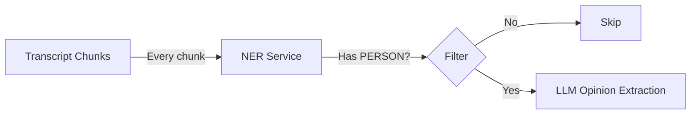

# Russian PERSON-NER Service

> Lightweight FastAPI service for detecting person mentions in Russian text.

## Table of Contents

- [Overview](#overview)
- [Quick Start](#quick-start)
  - [Docker](#docker-recommended)
  - [Local Development](#local-development)
- [API Endpoints](#api-endpoints)
  - [POST /ner/persons](#post-nerpersons)
  - [POST /ner/persons/batch](#post-nerpersonsbatch)
  - [GET /healthz](#get-healthz)
- [Usage Examples](#usage-examples)
- [Performance](#performance)
- [Limitations](#limitations)
- [Model](#model)

---

## Overview

This service uses `r1char9/ner-rubert-tiny-news` (RuBERT-tiny2) to detect person entities in Russian text. It's designed as a **cheap filter** before expensive LLM calls in the opinion extraction pipeline.



---

## Quick Start

### Docker (Recommended)

```bash
cd services/ner

# Build
docker build -t ru-person-ner:latest .

# Run
docker run --rm -p 8000:8000 ru-person-ner:latest
```

### Local Development

```bash
cd services/ner

# Create virtual environment
python -m venv .venv
source .venv/bin/activate

# Install dependencies (CPU-only PyTorch)
pip install torch --index-url https://download.pytorch.org/whl/cpu
pip install transformers fastapi uvicorn[standard]

# Run
uvicorn app.main:app --reload --port 8000
```

---

## API Endpoints

### `POST /ner/persons`

Extract person entities from a single Russian text.

**Request:**
```json
{
  "text": "Иванов раскритиковал Петрова, а Кузнецова похвалил.",
  "return_raw": false
}
```

**Response:**
```json
{
  "persons": ["Иванов", "Петрова", "Кузнецова"],
  "has_persons": true,
  "raw": null
}
```

### `POST /ner/persons/batch`

Extract person entities from multiple texts in a single request. More efficient than calling `/ner/persons` multiple times.

**Request:**
```json
{
  "texts": [
    "Иванов раскритиковал Петрова.",
    "Сегодня хорошая погода.",
    "Сидоров выступил с речью."
  ],
  "return_raw": false
}
```

**Response:**
```json
{
  "results": [
    {"persons": ["Иванов", "Петрова"], "has_persons": true, "raw": null},
    {"persons": [], "has_persons": false, "raw": null},
    {"persons": ["Сидоров"], "has_persons": true, "raw": null}
  ],
  "total_with_persons": 2
}
```

### `GET /healthz`

Health check endpoint for Docker orchestration.

**Response:**
```json
{
  "status": "healthy",
  "model": "r1char9/ner-rubert-tiny-news",
  "version": "1.0.0"
}
```

---

## Usage Examples

### curl

```bash
# Single text
curl -X POST "http://localhost:8000/ner/persons" \
  -H "Content-Type: application/json" \
  -d '{"text":"Иванов раскритиковал Петрова."}'

# Batch request
curl -X POST "http://localhost:8000/ner/persons/batch" \
  -H "Content-Type: application/json" \
  -d '{"texts":["Иванов met Петров.", "No persons here."]}'

# With raw NER spans
curl -X POST "http://localhost:8000/ner/persons" \
  -H "Content-Type: application/json" \
  -d '{"text":"Иванов раскритиковал Петрова.", "return_raw": true}'

# Health check
curl http://localhost:8000/healthz
```

### Python

```python
import httpx

# Single text
response = httpx.post(
    "http://localhost:8000/ner/persons",
    json={"text": "Сидоров критикует Иванова."}
)
data = response.json()

if data["has_persons"]:
    print(f"Found persons: {data['persons']}")

# Batch request (more efficient for multiple texts)
chunks = ["Иванов met Петров.", "Weather is nice.", "Сидоров spoke."]
response = httpx.post(
    "http://localhost:8000/ner/persons/batch",
    json={"texts": chunks}
)
batch_data = response.json()

print(f"Texts with persons: {batch_data['total_with_persons']}/{len(chunks)}")
for i, result in enumerate(batch_data["results"]):
    if result["has_persons"]:
        print(f"  Chunk {i}: {result['persons']}")
```

---

## Performance

| Metric | Value |
|--------|-------|
| Model size | ~50MB |
| RAM usage | ~300-500MB |
| Latency | ~50ms/chunk (CPU) |
| Throughput | ~20 chunks/second |

For a 3-hour video (~180 chunks at 60s each):
- NER processing: ~9 seconds total
- Typical filter rate: 30-70% of chunks skipped

---

## Limitations

- Tuned for **news/media** content (public figures)
- Returns names as they appear in text (inflected forms like "Петрова")
- For canonical forms, add morphology normalization (e.g., `pymorphy2`)
- For alias resolution ("Алексей Алексеевич" → "Иванов"), use entity linking

---

## Model

| Property | Value |
|----------|-------|
| **Name** | `r1char9/ner-rubert-tiny-news` |
| **Base** | RuBERT-tiny2 |
| **Entities** | PER, ORG, LOC, GEOPOLIT, MEDIA |
| **Source** | [Hugging Face](https://huggingface.co/r1char9/ner-rubert-tiny-news) |
