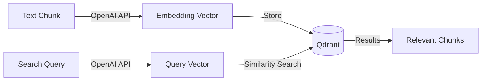

# OpenAI Embeddings API Setup Guide

> How to configure OpenAI API for generating text embeddings in this project.

## Table of Contents

- [Overview](#overview)
- [API Key: One Key for All Services](#api-key-one-key-for-all-services)
- [Embedding Models](#embedding-models)
- [Setup Instructions](#setup-instructions)
  - [Step 1: Verify Your API Key](#step-1-verify-your-api-key)
  - [Step 2: Configure Environment Variables](#step-2-configure-environment-variables)
  - [Step 3: Test Embeddings API](#step-3-test-embeddings-api)
- [Pricing](#pricing)
- [Security Best Practices](#security-best-practices)
- [Troubleshooting](#troubleshooting)
- [References](#references)

---

## Overview

This project uses OpenAI's Embeddings API to convert text into vector representations for semantic search. The embeddings are stored in Qdrant and queried to find relevant transcript chunks.



---

## API Key: One Key for All Services

**If you already have an OpenAI API key, you do NOT need a separate key for embeddings.**

OpenAI uses a **single API key** for all services:

| Service | Same API Key? |
|---------|---------------|
| Chat Completions (GPT-4, GPT-4o) | Yes |
| **Embeddings** | Yes |
| DALL-E (Images) | Yes |
| Whisper (Audio) | Yes |
| Fine-tuning | Yes |

The API key grants access to all endpoints. Different models are accessed via different API endpoints, but authentication is unified.

---

## Embedding Models

OpenAI offers several embedding models. This project uses `text-embedding-3-small` (recommended for MVP).

| Model | Dimensions | Best For |
|-------|------------|----------|
| `text-embedding-3-small` | 1,536 | **Recommended** - Good balance of quality and cost |
| `text-embedding-3-large` | 3,072 | Higher accuracy, higher cost |
| `text-embedding-ada-002` | 1,536 | Legacy model (not recommended for new projects) |

### Dimension Flexibility

Both `text-embedding-3-*` models support dimension reduction via the `dimensions` parameter. For example, you can request 256 dimensions instead of 1,536 to save storage space while maintaining good performance.

```python
# Example: Request smaller embeddings
embeddings = OpenAIEmbeddings(
    model="text-embedding-3-small",
    dimensions=512  # Reduced from default 1,536
)
```

---

## Setup Instructions

### Step 1: Verify Your API Key

If you already have an OpenAI API key, verify it works:

```bash
# Set your API key temporarily
export OPENAI_API_KEY="sk-..."

# Test with a simple embeddings request
curl https://api.openai.com/v1/embeddings \
  -H "Authorization: Bearer $OPENAI_API_KEY" \
  -H "Content-Type: application/json" \
  -d '{
    "input": "Hello world",
    "model": "text-embedding-3-small"
  }' 2>/dev/null | python3 -c "import sys,json; d=json.load(sys.stdin); print('Success! Vector length:', len(d['data'][0]['embedding']))"
```

Expected output:
```
Success! Vector length: 1536
```

### If You Don't Have an API Key

1. Go to [platform.openai.com](https://platform.openai.com/)
2. Sign in or create an account
3. Navigate to **API Keys** in the left sidebar
4. Click **Create new secret key**
5. Copy the key immediately (it won't be shown again)

### Step 2: Configure Environment Variables

**Option A: Export directly (development only)**

```bash
export OPENAI_API_KEY="sk-your-key-here"
```

**Option B: Use a `.env` file (recommended)**

Create a `.env` file in your project root:

```bash
cat > .env << 'EOF'
OPENAI_API_KEY=sk-your-key-here
QDRANT_URL=http://localhost:6333
QDRANT_COLLECTION=mentions_mvp
EOF
```

The project uses `python-dotenv` to load these automatically.

### Step 3: Test Embeddings API

Create a quick test script:

```python
#!/usr/bin/env python3
"""Test OpenAI Embeddings API connection."""
import os
from dotenv import load_dotenv
from langchain_openai import OpenAIEmbeddings

load_dotenv()

def main():
    if not os.environ.get("OPENAI_API_KEY"):
        print("Error: OPENAI_API_KEY not set")
        return

    embeddings = OpenAIEmbeddings(model="text-embedding-3-small")

    # Test embedding
    test_text = "This is a test sentence for embeddings."
    vector = embeddings.embed_query(test_text)

    print(f"Success!")
    print(f"  Model: text-embedding-3-small")
    print(f"  Vector dimensions: {len(vector)}")
    print(f"  First 5 values: {vector[:5]}")

if __name__ == "__main__":
    main()
```

Run it:

```bash
uv run python test_embeddings.py
```

---

## Pricing

Embeddings are billed per token (input only, no output tokens).

| Model | Price per 1M tokens | Batch Price |
|-------|---------------------|-------------|
| `text-embedding-3-small` | $0.02 | $0.01 |
| `text-embedding-3-large` | $0.13 | $0.065 |
| `text-embedding-ada-002` | $0.10 | $0.05 |

### Cost Estimation

For reference, 1 million tokens is approximately:
- ~750,000 words of English text
- ~3,000 pages of typical documents

**Example:** Embedding a 10-minute transcript (~1,500 words) costs approximately:
- `text-embedding-3-small`: ~$0.00004 (negligible)

### Monitor Usage

Check your usage at [platform.openai.com/usage](https://platform.openai.com/usage)

---

## Security Best Practices

### DO

- Store API keys in environment variables or `.env` files
- Add `.env` to `.gitignore` (already done in this project)
- Use separate API keys for development and production
- Set usage limits in your OpenAI dashboard
- Rotate keys periodically

### DON'T

- Commit API keys to version control
- Share keys in chat, email, or documentation
- Use production keys for local development
- Hardcode keys in source code

### Verify `.gitignore`

Ensure your `.gitignore` includes:

```gitignore
.env
.env.local
.env.*.local
```

---

## Troubleshooting

### "Invalid API Key"

```
openai.AuthenticationError: Invalid API key
```

**Solutions:**
1. Verify the key is correct (no extra spaces)
2. Check key hasn't been revoked at [platform.openai.com/api-keys](https://platform.openai.com/api-keys)
3. Ensure environment variable is set: `echo $OPENAI_API_KEY`

### "Rate Limit Exceeded"

```
openai.RateLimitError: Rate limit reached
```

**Solutions:**
1. Wait and retry (implement exponential backoff)
2. Check your tier limits at [platform.openai.com/account/limits](https://platform.openai.com/account/limits)
3. Upgrade your usage tier if needed

### "Insufficient Quota"

```
openai.RateLimitError: You exceeded your current quota
```

**Solutions:**
1. Add credits at [platform.openai.com/account/billing](https://platform.openai.com/account/billing)
2. Check usage at [platform.openai.com/usage](https://platform.openai.com/usage)

### Model Not Found

```
openai.NotFoundError: The model 'text-embedding-3-small' does not exist
```

**Solutions:**
1. Verify model name spelling
2. Check your API key has access to the model
3. Some organization restrictions may limit model access

---

## References

- [OpenAI API Reference - Embeddings](https://platform.openai.com/docs/api-reference/embeddings)
- [OpenAI Embedding Models](https://platform.openai.com/docs/models#embeddings)
- [LangChain OpenAI Embeddings](https://python.langchain.com/docs/integrations/text_embedding/openai)
- [Project MVP Phase 1 Plan](./plans/MVP_PHASE1.md)
- [Qdrant Local Setup Guide](./QDRANT_LOCAL_SETUP.md)
