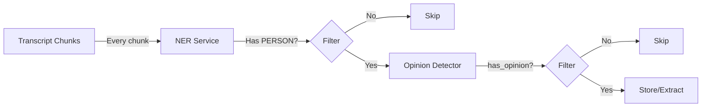

# Opinion Detector Service

> FastAPI service that detects opinions about persons in Russian text using OpenAI.

## Table of Contents

- [Overview](#overview)
- [Pipeline Position](#pipeline-position)
- [Quick Start](#quick-start)
  - [Docker](#docker-recommended)
  - [Local Development](#local-development)
- [API Endpoints](#api-endpoints)
  - [POST /detect-opinion](#post-detect-opinion)
  - [POST /detect-opinion/batch](#post-detect-opinionbatch)
  - [GET /chunks/{chunk_id}](#get-chunkschunk_id)
  - [GET /healthz](#get-healthz)
- [Configuration](#configuration)
- [What is an "Opinion"](#what-is-an-opinion)
- [Usage Examples](#usage-examples)
- [Cost Estimates](#cost-estimates)

---

## Overview

This service uses OpenAI API to detect whether text contains opinions about persons. It's designed as step 3 in the opinion extraction pipeline, after NER filtering.

---

## Pipeline Position



| Step | Service | Purpose | Cost |
|------|---------|---------|------|
| 2 | NER | Filter chunks without persons | Free (local) |
| 3 | **Opinion Detector** | Detect if opinion exists | ~$0.001/chunk |
| 4 | Opinion Extractor | Deep extraction (optional) | ~$0.01/chunk |

---

## Quick Start

### Docker (Recommended)

```bash
cd services/opinion-detector

# Build
docker build -t opinion-detector:latest .

# Run (requires OPENAI_API_KEY)
docker run --rm -p 8001:8001 \
  -e OPENAI_API_KEY="$OPENAI_API_KEY" \
  -v $(pwd)/data:/app/data \
  opinion-detector:latest
```

### Local Development

```bash
cd services/opinion-detector

# Create virtual environment
python -m venv .venv
source .venv/bin/activate

# Install dependencies
pip install fastapi uvicorn[standard] openai pydantic tenacity

# Set environment variables
export OPENAI_API_KEY="sk-..."

# Run
uvicorn app.main:app --reload --port 8001
```

---

## API Endpoints

### `POST /detect-opinion`

Detect opinion in a single text chunk.

**Request:**
```json
{
  "chunk_id": "vid123_0042",
  "start": 120.0,
  "end": 165.0,
  "text": "Вот такое стремление Иванова к миру. Он всегда был за мирное решение.",
  "persons": ["Иванов"]
}
```

**Response:**
```json
{
  "has_opinion": true,
  "targets": ["Иванов"],
  "opinion_spans": ["Вот такое стремление Иванова к миру."],
  "polarity": "negative",
  "confidence": 0.86
}
```

### `POST /detect-opinion/batch`

Detect opinions in multiple chunks (more efficient).

**Request:**
```json
{
  "items": [
    {"chunk_id": "001", "start": 0, "end": 30, "text": "...", "persons": ["Иванов"]},
    {"chunk_id": "002", "start": 30, "end": 60, "text": "...", "persons": ["Петров"]}
  ]
}
```

**Response:**
```json
{
  "results": [
    {"has_opinion": true, "targets": ["Иванов"], ...},
    {"has_opinion": false, "targets": [], ...}
  ],
  "total_with_opinions": 1
}
```

### `GET /chunks/{chunk_id}`

Retrieve stored detection result.

**Response:**
```json
{
  "chunk_id": "vid123_0042",
  "start": 120.0,
  "end": 165.0,
  "persons": ["Иванов"],
  "has_opinion": true,
  "targets": ["Иванов"],
  "opinion_spans": ["Вот такое стремление Иванова к миру."],
  "polarity": "negative",
  "confidence": 0.86,
  "created_at": "2024-01-15T10:30:00Z"
}
```

### `GET /healthz`

Health check endpoint.

**Response:**
```json
{
  "status": "healthy",
  "model": "gpt-4o-mini",
  "version": "1.0.0"
}
```

---

## Configuration

| Environment Variable | Default | Description |
|---------------------|---------|-------------|
| `OPENAI_API_KEY` | (required) | OpenAI API key |
| `OPENAI_MODEL` | `gpt-4o-mini` | Model to use |
| `MAX_TEXT_LENGTH` | `4000` | Max chars before truncation |
| `OPINION_DB_PATH` | `data/opinions.db` | SQLite database path |

---

## What is an "Opinion"

We treat an "opinion about a person" as any of:

| Type | Example |
|------|---------|
| Evaluative judgment | "Иванов - отличный специалист" |
| Praise/blame | "Петров провалил проект" |
| Accusation | "Сидоров виноват в этом" |
| Sarcasm/irony | "Вот такое стремление Иванова к миру" |
| Attribution of motives | "Он делает это для своей выгоды" |
| Predictions about person | "Иванов точно проиграет" |

**NOT opinion:** Pure factual mentions ("Иванов сказал...", "Петров посетил...")

---

## Usage Examples

### curl

```bash
# Single detection
curl -X POST "http://localhost:8001/detect-opinion" \
  -H "Content-Type: application/json" \
  -d '{
    "chunk_id": "demo_001",
    "start": 0,
    "end": 30,
    "text": "Вот такое стремление Иванова к миру.",
    "persons": ["Иванов"]
  }'

# Batch detection
curl -X POST "http://localhost:8001/detect-opinion/batch" \
  -H "Content-Type: application/json" \
  -d '{
    "items": [
      {"chunk_id": "001", "start": 0, "end": 30, "text": "Иванов молодец.", "persons": ["Иванов"]},
      {"chunk_id": "002", "start": 30, "end": 60, "text": "Сегодня хорошая погода.", "persons": []}
    ]
  }'

# Retrieve stored result
curl "http://localhost:8001/chunks/demo_001"

# Health check
curl "http://localhost:8001/healthz"
```

### Python

```python
import httpx

# Single detection
response = httpx.post(
    "http://localhost:8001/detect-opinion",
    json={
        "chunk_id": "demo_001",
        "start": 0,
        "end": 30,
        "text": "Вот такое стремление Иванова к миру.",
        "persons": ["Иванов"],
    },
)
result = response.json()

if result["has_opinion"]:
    print(f"Opinion about: {result['targets']}")
    print(f"Polarity: {result['polarity']}")
    print(f"Spans: {result['opinion_spans']}")
```

---

## Cost Estimates

Using `gpt-4o-mini` (~$0.15/1M input tokens, ~$0.60/1M output tokens):

| Scenario | Chunks/day | With persons | Cost/day |
|----------|------------|--------------|----------|
| 3h video | ~180 | ~50 (30%) | ~$0.05 |
| 10h video | ~600 | ~180 (30%) | ~$0.18 |

**Cost reduction strategies:**
- NER filtering removes 30-70% of chunks
- SQLite caching prevents re-processing
- Batch endpoint reduces overhead
