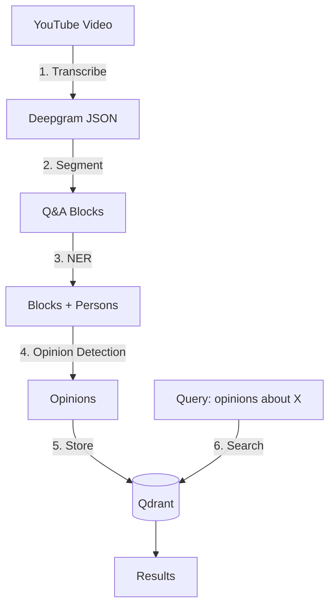

# Pipeline Guide

> Step-by-step manual testing guide for the Media RAG Pipeline.

## Table of Contents

- [Overview](#overview)
- [Prerequisites](#prerequisites)
- [End-to-End Pipeline](#end-to-end-pipeline)
  - [Step 1: Transcribe YouTube Video](#step-1-transcribe-youtube-video)
  - [Step 2: Segment into Narrative/Q&A](#step-2-segment-into-narrativeqa)
  - [Step 3: Extract Persons (NER)](#step-3-extract-persons-ner)
  - [Step 4: Detect Opinions](#step-4-detect-opinions)
  - [Step 5: Store in Vector DB](#step-5-store-in-vector-db)
  - [Step 6: Search Opinions](#step-6-search-opinions)
- [Quick Reference](#quick-reference)

---

## Overview

The pipeline processes YouTube videos to extract and search opinions about persons:



**Services required:**
| Service | Port | Purpose |
|---------|------|---------|
| NER Service | 8000 | Detect person mentions |
| LLM Analyzer | 8001 | Segment + Opinion detection |
| Qdrant | 6333 | Vector database |

---

## Prerequisites

### 1. Environment Variables

Create `.env` file in project root:

```bash
OPENAI_API_KEY=sk-...
DEEPGRAM_API_KEY=...
```

### 2. Start Services

```bash
# Terminal 1: NER Service
cd services/ner
docker build -t ner-service:latest .
docker run --rm -p 8000:8000 ner-service:latest

# Terminal 2: LLM Analyzer
cd services/llm-analyzer
docker build -t llm-analyzer:latest .
docker run --rm -p 8001:8001 \
  -e OPENAI_API_KEY="$OPENAI_API_KEY" \
  -v $(pwd)/data:/app/data \
  -v $(pwd)/exports:/app/exports \
  llm-analyzer:latest

# Terminal 3: Qdrant
docker run --rm -p 6333:6333 -p 6334:6334 \
  -v $(pwd)/qdrant_storage:/qdrant/storage \
  qdrant/qdrant
```

### 3. Verify Services

```bash
# Check all services are healthy
curl http://localhost:8000/healthz  # NER
curl http://localhost:8001/healthz  # LLM Analyzer
curl http://localhost:6333/         # Qdrant
```

---

## End-to-End Pipeline

### Step 1: Transcribe YouTube Video

```bash
# Transcribe a video (outputs JSON, SRT, TXT)
uv run python src/transcribe.py "https://youtube.com/watch?v=VIDEO_ID"

# Files created:
# - data/transcripts/VIDEO_ID.json  <- Use this
# - data/transcripts/VIDEO_ID.srt
# - data/transcripts/VIDEO_ID.txt
```

**Output:** `data/transcripts/VIDEO_ID.json` with utterances

---

### Step 2: Segment into Narrative/Q&A

Send the Deepgram JSON to LLM Analyzer to split into narrative and Q&A regions:

```bash
VIDEO_ID="VIDEO_ID"

# Simple file upload using curl's @file syntax
curl -X POST "http://localhost:8001/segment/qa/from-deepgram-file?video_id=$VIDEO_ID" \
  -H "Content-Type: application/json" \
  -d @data/transcripts/$VIDEO_ID.json | jq .
```

**Output:**
```json
{
  "video_id": "VIDEO_ID",
  "boundary_segments": [
    {"seg_id": "seg_000", "type": "narrative", "start": 0.0, "end": 1200.5, ...},
    {"seg_id": "seg_001", "type": "qa", "start": 1200.5, "end": 3600.0, ...}
  ],
  "qa_blocks": [
    {"block_id": "qa_000", "start": 1200.5, "end": 1350.0, "text": "...", "answer_summary": "..."},
    {"block_id": "qa_001", "start": 1350.0, "end": 1500.0, "text": "...", "answer_summary": "..."}
  ]
}
```

**Export file:** `services/llm-analyzer/exports/VIDEO_ID.json`

---

### Step 3: Extract Persons (NER)

For each Q&A block, find person mentions:

```bash
# Single block
curl -X POST "http://localhost:8000/ner/persons" \
  -H "Content-Type: application/json" \
  -d '{
    "text": "Иванов сказал, что Петров сделал ошибку."
  }' | jq .

# Batch endpoint for multiple blocks
curl -X POST "http://localhost:8000/ner/persons/batch" \
  -H "Content-Type: application/json" \
  -d '{
    "texts": [
      "Иванов сказал, что Петров сделал ошибку.",
      "Сегодня хорошая погода."
    ]
  }' | jq .
```

**Output:**
```json
{
  "persons": ["Иванов", "Петров"],
  "has_persons": true
}
```

---

### Step 4: Detect Opinions

For blocks with persons, detect if opinions are expressed:

```bash
curl -X POST "http://localhost:8001/detect-opinion" \
  -H "Content-Type: application/json" \
  -d '{
    "chunk_id": "VIDEO_ID_qa_000",
    "start": 1200.5,
    "end": 1350.0,
    "text": "Иванов сказал, что Петров сделал ошибку. Это было некомпетентно.",
    "persons": ["Иванов", "Петров"]
  }' | jq .
```

**Output:**
```json
{
  "has_opinion": true,
  "targets": ["Петров"],
  "opinion_spans": ["Это было некомпетентно"],
  "polarity": "negative",
  "confidence": 0.85
}
```

---

### Step 5: Store in Vector DB

```bash
# Ingest chunks into Qdrant
uv run python src/ingest.py data/transcripts/VIDEO_ID.txt
```

For opinion-enriched storage, you would create chunks with metadata including:
- `text`: Block text
- `video_id`: Video identifier
- `start`, `end`: Timestamps
- `persons`: List of persons mentioned
- `has_opinion`: Whether opinion was detected
- `opinion_targets`: Who the opinions are about

---

### Step 6: Search Opinions

```bash
# Query Qdrant for relevant chunks
uv run python src/query.py "что говорят про Иванова"
```

---

## Quick Reference

### Full Pipeline Script

```bash
#!/bin/bash
VIDEO_ID="VIDEO_ID"

# 1. Transcribe
uv run python src/transcribe.py "https://youtube.com/watch?v=$VIDEO_ID"

# 2. Segment (using simple @file syntax)
SEGMENTS=$(curl -s -X POST "http://localhost:8001/segment/qa/from-deepgram-file?video_id=$VIDEO_ID" \
  -H "Content-Type: application/json" \
  -d @data/transcripts/$VIDEO_ID.json)

echo "$SEGMENTS" | jq '.qa_blocks | length'  # Number of Q&A blocks

# 3. For each Q&A block, run NER + Opinion detection
echo "$SEGMENTS" | jq -c '.qa_blocks[]' | while read block; do
  TEXT=$(echo $block | jq -r '.text')
  BLOCK_ID=$(echo $block | jq -r '.block_id')
  START=$(echo $block | jq -r '.start')
  END=$(echo $block | jq -r '.end')

  # NER
  PERSONS=$(curl -s -X POST "http://localhost:8000/ner/persons" \
    -H "Content-Type: application/json" \
    -d "{\"text\": \"$TEXT\"}" | jq -r '.persons')

  if [ "$PERSONS" != "[]" ]; then
    # Opinion detection
    curl -s -X POST "http://localhost:8001/detect-opinion" \
      -H "Content-Type: application/json" \
      -d "{
        \"chunk_id\": \"${VIDEO_ID}_${BLOCK_ID}\",
        \"start\": $START,
        \"end\": $END,
        \"text\": \"$TEXT\",
        \"persons\": $PERSONS
      }" | jq .
  fi
done
```

### Service URLs

| Service | Health Check | Main Endpoint |
|---------|--------------|---------------|
| NER | `GET /healthz` | `POST /ner/persons` |
| LLM Analyzer | `GET /healthz` | `POST /segment/qa/from-deepgram-file` |
| Qdrant | `GET /` | `POST /collections/{name}/points/search` |

### Pipeline Order

1. **Transcribe** → Deepgram JSON with utterances
2. **Segment** → Narrative/Q&A boundaries + semantic blocks
3. **NER** → Find persons in Q&A blocks
4. **Opinion** → Detect opinions about persons
5. **Store** → Save to vector DB with metadata
6. **Search** → Query opinions about specific persons
