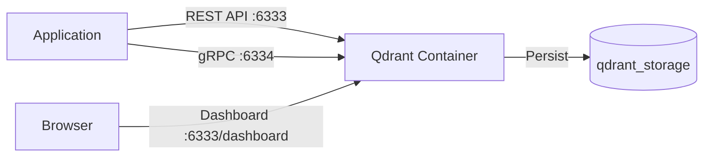
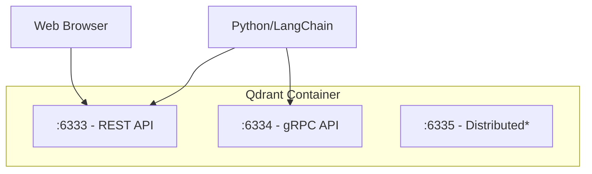
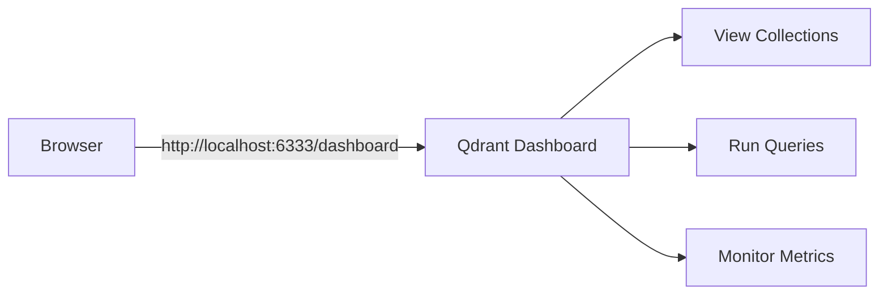

# Qdrant Local Setup Guide

> Step-by-step instructions for running Qdrant vector database locally in Docker.

## Table of Contents

- [Overview](#overview)
- [Prerequisites](#prerequisites)
- [Quick Start](#quick-start)
- [Detailed Setup](#detailed-setup)
  - [Step 1: Create Storage Directory](#step-1-create-storage-directory)
  - [Step 2: Run Qdrant Container](#step-2-run-qdrant-container)
  - [Step 3: Verify Installation](#step-3-verify-installation)
- [Configuration](#configuration)
  - [Port Reference](#port-reference)
  - [Environment Variables](#environment-variables)
  - [Custom Configuration File](#custom-configuration-file)
- [Web Dashboard](#web-dashboard)
- [Container Management](#container-management)
- [Troubleshooting](#troubleshooting)
- [References](#references)

---

## Overview

Qdrant is an open-source vector similarity search engine. This guide covers running Qdrant locally in Docker for development purposes.



**Version:** This guide uses Qdrant v1.16.x (latest stable as of January 2025).

---

## Prerequisites

| Requirement | Version | Check Command |
|-------------|---------|---------------|
| Docker Desktop | 20.10+ | `docker --version` |
| Available ports | 6333, 6334 | `lsof -i :6333` |
| Disk space | ~500MB+ | - |

### Install Docker Desktop (macOS)

If Docker is not installed:

```bash
# Using Homebrew
brew install --cask docker

# Then launch Docker Desktop from Applications
```

Verify Docker is running:

```bash
docker info > /dev/null 2>&1 && echo "Docker is running" || echo "Docker is NOT running"
```

---

## Quick Start

For those who want to get running immediately:

```bash
# Create storage directory
mkdir -p ./qdrant_storage

# Run Qdrant
docker run -d \
  --name qdrant \
  -p 6333:6333 \
  -p 6334:6334 \
  -v "$(pwd)/qdrant_storage:/qdrant/storage" \
  qdrant/qdrant:v1.16.3

# Verify it's running
curl -s http://localhost:6333/healthz && echo " Qdrant is healthy"
```

Dashboard: http://localhost:6333/dashboard

---

## Detailed Setup

### Step 1: Create Storage Directory

Create a directory for persistent data storage. This ensures your vectors survive container restarts.

```bash
# Navigate to your project root
cd /Users/dremdem/work/media_rag_pipeline

# Create storage directory
mkdir -p ./qdrant_storage
```

**Why persistent storage?** Without mounting a volume, all data is lost when the container stops.

### Step 2: Run Qdrant Container

Run Qdrant with persistent storage:

```bash
docker run -d \
  --name qdrant \
  -p 6333:6333 \
  -p 6334:6334 \
  -v "$(pwd)/qdrant_storage:/qdrant/storage" \
  qdrant/qdrant:v1.16.3
```

**Flags explained:**

| Flag | Purpose |
|------|---------|
| `-d` | Run in detached mode (background) |
| `--name qdrant` | Container name for easy reference |
| `-p 6333:6333` | Expose REST API port |
| `-p 6334:6334` | Expose gRPC port |
| `-v "...:/qdrant/storage"` | Mount local directory for data persistence |
| `qdrant/qdrant:v1.16.3` | Specific version (recommended over `latest`) |

### Step 3: Verify Installation

Run these checks to ensure Qdrant is working:

```bash
# Check container is running
docker ps --filter name=qdrant --format "table {{.Names}}\t{{.Status}}\t{{.Ports}}"

# Health check endpoint
curl -s http://localhost:6333/healthz
# Expected output: (empty response with HTTP 200)

# Get cluster info
curl -s http://localhost:6333/cluster | python3 -m json.tool

# Get collections (should be empty initially)
curl -s http://localhost:6333/collections | python3 -m json.tool
```

Expected output for `/collections`:

```json
{
    "result": {
        "collections": []
    },
    "status": "ok",
    "time": 0.000012345
}
```

---

## Configuration

### Port Reference



| Port | Protocol | Purpose | Required for MVP |
|------|----------|---------|------------------|
| 6333 | HTTP | REST API + Web Dashboard | Yes |
| 6334 | HTTP/2 | gRPC API (higher performance) | Recommended |
| 6335 | HTTP | Distributed cluster communication | No (single node) |

### Environment Variables

Qdrant supports configuration via environment variables:

```bash
docker run -d \
  --name qdrant \
  -p 6333:6333 \
  -p 6334:6334 \
  -e QDRANT__SERVICE__GRPC_PORT=6334 \
  -e QDRANT__LOG_LEVEL=INFO \
  -v "$(pwd)/qdrant_storage:/qdrant/storage" \
  qdrant/qdrant:v1.16.3
```

Common environment variables:

| Variable | Default | Description |
|----------|---------|-------------|
| `QDRANT__SERVICE__HTTP_PORT` | 6333 | REST API port |
| `QDRANT__SERVICE__GRPC_PORT` | 6334 | gRPC port |
| `QDRANT__LOG_LEVEL` | INFO | Logging level (DEBUG, INFO, WARN, ERROR) |
| `QDRANT__STORAGE__STORAGE_PATH` | `/qdrant/storage` | Data directory inside container |

### Custom Configuration File

For advanced configuration, mount a custom YAML file:

```bash
# Create config file
cat > ./qdrant_config.yaml << 'EOF'
log_level: INFO

storage:
  storage_path: /qdrant/storage

  # Optimizer settings
  optimizers:
    default_segment_number: 2

service:
  http_port: 6333
  grpc_port: 6334
  enable_tls: false
EOF

# Run with custom config
docker run -d \
  --name qdrant \
  -p 6333:6333 \
  -p 6334:6334 \
  -v "$(pwd)/qdrant_storage:/qdrant/storage" \
  -v "$(pwd)/qdrant_config.yaml:/qdrant/config/production.yaml" \
  qdrant/qdrant:v1.16.3
```

---

## Web Dashboard

Qdrant includes a built-in web UI for exploring collections and running queries.

**Access:** http://localhost:6333/dashboard



**Features:**
- Browse and manage collections
- View vector data and metadata
- Execute search queries
- Monitor cluster health

**Note:** The dashboard requires no authentication in local development mode.

---

## Container Management

### View Logs

```bash
# Follow logs in real-time
docker logs -f qdrant

# Last 100 lines
docker logs --tail 100 qdrant
```

### Stop Container

```bash
# Stop (data preserved in qdrant_storage)
docker stop qdrant
```

### Start Existing Container

```bash
# Start previously stopped container
docker start qdrant
```

### Remove Container

```bash
# Stop and remove container (data still preserved in qdrant_storage)
docker stop qdrant && docker rm qdrant
```

### Complete Reset

```bash
# Remove container and all data
docker stop qdrant 2>/dev/null
docker rm qdrant 2>/dev/null
rm -rf ./qdrant_storage

# Start fresh
mkdir -p ./qdrant_storage
docker run -d \
  --name qdrant \
  -p 6333:6333 \
  -p 6334:6334 \
  -v "$(pwd)/qdrant_storage:/qdrant/storage" \
  qdrant/qdrant:v1.16.3
```

### Check Resource Usage

```bash
docker stats qdrant --no-stream
```

---

## Troubleshooting

### Docker Daemon Not Running

**Error:** `Cannot connect to the Docker daemon`

**Solution:**
```bash
# macOS: Start Docker Desktop from Applications
open -a Docker

# Wait for Docker to start, then verify
docker info
```

### Port Already in Use

**Error:** `Bind for 0.0.0.0:6333 failed: port is already allocated`

**Solution:**
```bash
# Find what's using the port
lsof -i :6333

# Kill the process or use different ports
docker run -d \
  --name qdrant \
  -p 6343:6333 \
  -p 6344:6334 \
  -v "$(pwd)/qdrant_storage:/qdrant/storage" \
  qdrant/qdrant:v1.16.3

# Access via new port: http://localhost:6343
```

### Container Keeps Restarting

**Check logs:**
```bash
docker logs qdrant
```

**Common causes:**
- Corrupted storage: Remove `qdrant_storage` and restart
- Permission issues: Ensure the storage directory is writable

### Connection Refused

**Error:** `curl: (7) Failed to connect to localhost port 6333`

**Checklist:**
```bash
# 1. Is container running?
docker ps --filter name=qdrant

# 2. Check container logs
docker logs qdrant

# 3. Verify port mapping
docker port qdrant
```

### Slow Performance on macOS

Docker volumes can be slow on macOS. For development, this is usually acceptable. If needed:

```bash
# Use delegated consistency for better write performance
docker run -d \
  --name qdrant \
  -p 6333:6333 \
  -p 6334:6334 \
  -v "$(pwd)/qdrant_storage:/qdrant/storage:delegated" \
  qdrant/qdrant:v1.16.3
```

---

## References

- [Qdrant Official Documentation](https://qdrant.tech/documentation/)
- [Qdrant Docker Hub](https://hub.docker.com/r/qdrant/qdrant)
- [Qdrant GitHub Releases](https://github.com/qdrant/qdrant/releases)
- [Project MVP Phase 1 Plan](./plans/MVP_PHASE1.md)
