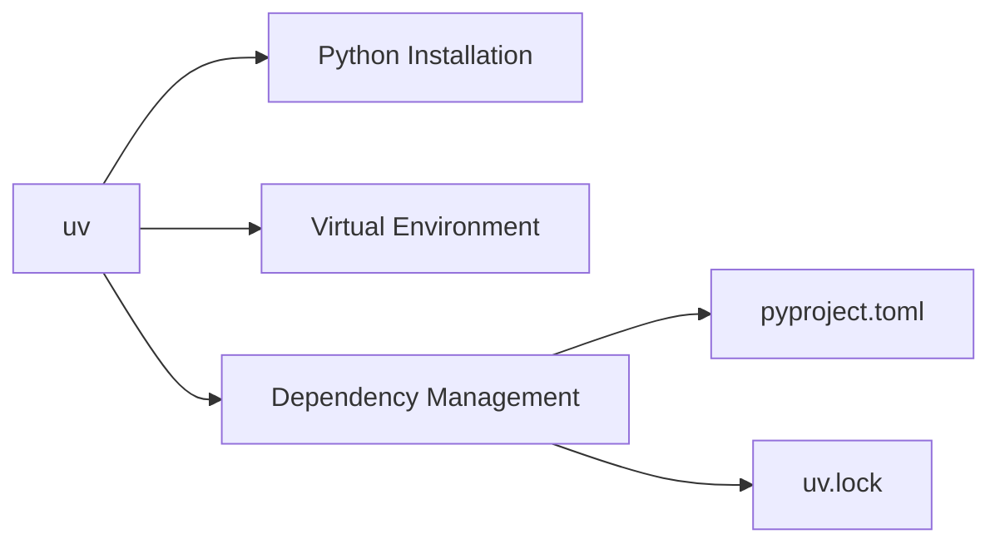

# Python Environment Setup with uv

> Setting up the Python development environment using uv package manager.

## Table of Contents

- [Overview](#overview)
- [Prerequisites](#prerequisites)
- [Install uv](#install-uv)
- [Project Setup](#project-setup)
  - [Clone and Initialize](#clone-and-initialize)
  - [Install Dependencies](#install-dependencies)
  - [Verify Installation](#verify-installation)
- [Common Commands](#common-commands)
- [Troubleshooting](#troubleshooting)
- [References](#references)

---

## Overview

This project uses [uv](https://docs.astral.sh/uv/) as the Python package manager. uv is a fast, modern replacement for pip, virtualenv, and pyenv, written in Rust by [Astral](https://astral.sh/).



**Why uv?**
- 10-100x faster than pip
- Manages Python versions automatically
- Single tool replaces pip, virtualenv, pyenv
- Lock file ensures reproducible builds

---

## Prerequisites

| Requirement | Notes |
|-------------|-------|
| macOS / Linux / Windows | All platforms supported |
| Terminal access | For running commands |
| Internet connection | For downloading packages |

**Note:** You do NOT need Python pre-installed. uv will install Python for you.

---

## Install uv

### macOS / Linux

```bash
curl -LsSf https://astral.sh/uv/install.sh | sh
```

### macOS with Homebrew (alternative)

```bash
brew install uv
```

### Windows

```powershell
powershell -ExecutionPolicy ByPass -c "irm https://astral.sh/uv/install.ps1 | iex"
```

### Verify Installation

```bash
uv --version
```

Expected output (version may vary):
```
uv 0.5.x
```

---

## Project Setup

### Clone and Initialize

If you've just cloned this repository:

```bash
cd media_rag_pipeline

# uv will automatically:
# 1. Install the correct Python version (from .python-version)
# 2. Create a virtual environment
# 3. Install all dependencies (from uv.lock)
uv sync
```

### Install Dependencies

Dependencies are already defined in `pyproject.toml`. To install them:

```bash
# Install all dependencies
uv sync

# Or install with development dependencies
uv sync --all-extras
```

### Verify Installation

```bash
# Check Python version
uv run python --version

# Check installed packages
uv pip list

# Test import of key packages
uv run python -c "import langchain; print('LangChain:', langchain.__version__)"
```

---

## Common Commands

### Running Scripts

```bash
# Run any Python script
uv run python src/ingest.py

# Run with environment variables
OPENAI_API_KEY=sk-xxx uv run python src/ingest.py
```

### Managing Dependencies

```bash
# Add a new package
uv add requests

# Add a development dependency
uv add --dev pytest

# Remove a package
uv remove requests

# Update all packages
uv lock --upgrade
uv sync
```

### Python Version Management

```bash
# Install a specific Python version
uv python install 3.12

# Pin project to specific version
uv python pin 3.12

# List available Python versions
uv python list
```

### Virtual Environment

```bash
# uv automatically manages .venv, but you can also:

# Activate manually (optional, not usually needed)
source .venv/bin/activate

# Deactivate
deactivate
```

---

## Troubleshooting

### "uv: command not found"

The installer adds uv to your PATH, but you may need to restart your terminal:

```bash
# Reload shell configuration
source ~/.zshrc   # for zsh
source ~/.bashrc  # for bash

# Or restart your terminal
```

### "Python version not found"

uv will auto-install Python, but you can manually install:

```bash
uv python install 3.12
```

### Lock File Conflicts

If `uv.lock` has conflicts after a merge:

```bash
# Regenerate lock file
uv lock

# Then sync
uv sync
```

### Permission Denied

```bash
# If you get permission errors during installation
chmod +x ~/.local/bin/uv
```

### Slow on First Run

The first `uv sync` downloads and caches packages. Subsequent runs are much faster.

---

## References

- [uv Documentation](https://docs.astral.sh/uv/)
- [uv Installation Guide](https://docs.astral.sh/uv/getting-started/installation/)
- [uv GitHub Repository](https://github.com/astral-sh/uv)
- [Astral Blog - Introducing uv](https://astral.sh/blog/uv)
