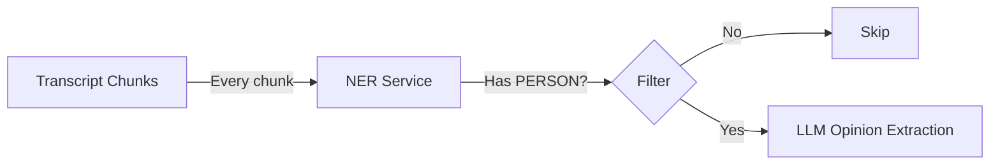

# Russian PERSON-NER Service

> Lightweight FastAPI service for detecting person mentions in Russian text.

## Overview

This service uses `r1char9/ner-rubert-tiny-news` (RuBERT-tiny2) to detect person entities in Russian text. It's designed as a **cheap filter** before expensive LLM calls in the opinion extraction pipeline.



## Quick Start

### Docker (Recommended)

```bash
cd services/ner

# Build
docker build -t ru-person-ner:latest .

# Run
docker run --rm -p 8000:8000 ru-person-ner:latest
```

### Local Development

```bash
cd services/ner

# Create virtual environment
python -m venv .venv
source .venv/bin/activate

# Install dependencies (CPU-only PyTorch)
pip install torch --index-url https://download.pytorch.org/whl/cpu
pip install transformers fastapi uvicorn[standard]

# Run
uvicorn app.main:app --reload --port 8000
```

## API Endpoints

### `POST /ner/persons`

Extract person entities from Russian text.

**Request:**
```json
{
  "text": "Иванов раскритиковал Петрова, а Кузнецова похвалил.",
  "return_raw": false
}
```

**Response:**
```json
{
  "persons": ["Иванов", "Петрова", "Кузнецова"],
  "has_persons": true,
  "raw": null
}
```

### `GET /healthz`

Health check endpoint for Docker orchestration.

**Response:**
```json
{
  "status": "healthy",
  "model": "r1char9/ner-rubert-tiny-news",
  "version": "1.0.0"
}
```

## Usage Examples

### curl

```bash
# Basic request
curl -X POST "http://localhost:8000/ner/persons" \
  -H "Content-Type: application/json" \
  -d '{"text":"Иванов раскритиковал Петрова."}'

# With raw NER spans
curl -X POST "http://localhost:8000/ner/persons" \
  -H "Content-Type: application/json" \
  -d '{"text":"Иванов раскритиковал Петрова.", "return_raw": true}'

# Health check
curl http://localhost:8000/healthz
```

### Python

```python
import httpx

response = httpx.post(
    "http://localhost:8000/ner/persons",
    json={"text": "Сидоров критикует Иванова."}
)
data = response.json()

if data["has_persons"]:
    print(f"Found persons: {data['persons']}")
    # Call LLM for opinion extraction
else:
    print("No persons mentioned, skipping LLM")
```

## Performance

| Metric | Value |
|--------|-------|
| Model size | ~50MB |
| RAM usage | ~300-500MB |
| Latency | ~50ms/chunk (CPU) |
| Throughput | ~20 chunks/second |

For a 3-hour video (~180 chunks at 60s each):
- NER processing: ~9 seconds total
- Typical filter rate: 30-70% of chunks skipped

## Limitations

- Tuned for **news/media** content (public figures)
- Returns names as they appear in text (inflected forms like "Петрова")
- For canonical forms, add morphology normalization (e.g., `pymorphy2`)
- For alias resolution ("Алексей Алексеевич" → "Иванов"), use entity linking

## Model

- **Name:** `r1char9/ner-rubert-tiny-news`
- **Base:** RuBERT-tiny2
- **Entities:** PER, ORG, LOC, GEOPOLIT, MEDIA
- **Source:** [Hugging Face](https://huggingface.co/r1char9/ner-rubert-tiny-news)
